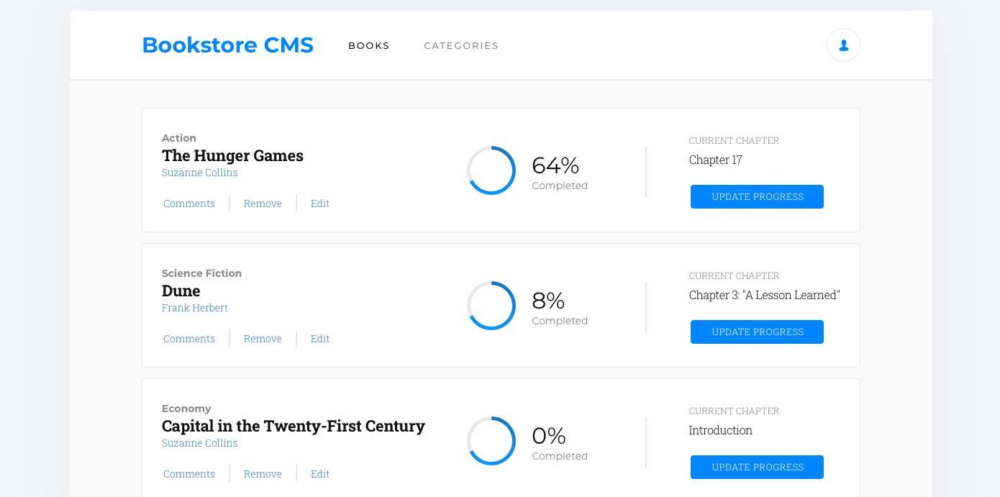

# Magic Books

<!--
*** Thanks for checking out this README Template. If you have a suggestion that would
*** make this better, please fork the repo and create a pull request or simply open
*** an issue with the tag "enhancement".
*** Thanks again! Now go create something AMAZING! :D
-->

<!-- PROJECT SHIELDS -->
<!--
*** I'm using markdown "reference style" links for readability.
*** Reference links are enclosed in brackets [ ] instead of parentheses ( ).
*** See the bottom of this document for the declaration of the reference variables
*** for contributors-url, forks-url, etc. This is an optional, concise syntax you may use.
*** https://www.markdownguide.org/basic-syntax/#reference-style-links
-->

[![Contributors][contributors-shield]][contributors-url]
[![Forks][forks-shield]][forks-url]
[![Stargazers][stars-shield]][stars-url]
[![Issues][issues-shield]][issues-url]

<!-- PROJECT LOGO -->
<br />
<p align="center">
  <a href="https://github.com/ioanniskousis/magic-books">
    
  </a>
  
  <h3 align="center">The Magic Books Application</h3>
  
  <p align="center">
    This project is part of the Microverse curriculum in React course!
    <br />
    <a href="https://github.com/ioanniskousis/magic-books"><strong>Explore the docs</strong></a>
    <br />
    <a href="https://magic-books-jgk.herokuapp.com">Live Version</a>
    <br />
    <a href="https://github.com/ioanniskousis/magic-books/issues">Report Bug</a>
    <span> - </span>
    <a href="https://github.com/ioanniskousis/magic-books/issues">Request Feature</a>
  </p>
</p>

## This is a Book Store application

<hr />

<!-- TABLE OF CONTENTS -->

## Table of Contents

- [Screen Shots](#screen-shots)
- [About the Project](#about-the-project)
- [Application Instructions](#application-instructions)
- [Live Version](#live-version)
- [System Requierments](#system-requierments)
- [Development](#development)
- [Dependencies](#dependencies)
- [Built With](#built-with)
- [Contributors](#contributors)
- [Acknowledgements](#acknowledgements)

## Screen Shots


<hr />

<!-- ABOUT THE PROJECT -->

## About The Project

The project was created using the create-react-app model

The project files tree:

```
-src  
  -components  
    App.js  
    book.js  
    CategoryFilter.js  
  -containers  
    booksList.js  
    booksForm.js  
  -actions  
    index.js  
  -reducers  
    books.js  
    index.js  
    filter.js  
  index.js  
  booksSeed.js  
```
  - The entry point is root **index.js** where the **App** components is render through the **Container** components of Redux. 
  - Componets **BooksList, Book, and BooksForm** are held in respective files in **components/** folder  
  - Actions **createBook** and **removeBook** are in **actions/index.js**  
  - Reducers are in **reducers/** folder, currently only 1, the **booksReducer** in reducers/books.js is combined into **rootReducer** held in reducers/index.js  
  - The **App** component renders **BooksList** and **BooksForm** components  
  - The **BookList** components renders the **books table**. Implements removing books feature  
  - The **BooksForm** adds new books given that title and category are not empty  
  - The **Book** component renders a **table row** with a book's data  
  - The **booksSeed** array initializes the state with a set of books  
  - The **CategoryFilter** implements the category filtering on the books  

<hr/>

<!-- ABOUT THE PROJECT -->

## Application Instructions

<hr/>

## Live Version

[Heroku](https://magic-books-jgk.herokuapp.com)

<hr/>

## System Requierments

- JavaScript Enabled
- You need to Disable Cross-Origin-Restrictions from your browser if you want to open the index.html from your file system without using a server.

<hr/>

## Development

- Clone the project

```
  https://github.com/ioanniskousis/magic-books.git

  Use VSCode and Live Server to show index.html
  Since webpack is used, run 'npm run build' on you terminal before opening
```

<hr/>

## Dependencies

please run

```
  npm run build
```

to comply with the dependencies held in package.json

<hr/>

## Built With

This project was built using these technologies.

- React
- Redux
- CSS3
- webpack
- Git - GitHub
- ESLint
- Stylelint
- heroku

<hr/>

<!-- CONTACT -->

## Contributors

:bust_in_silhouette:
​

## Ioannis Kousis

- Github: [@ioanniskousis](https://github.com/ioanniskousis)
- Twitter: [@ioanniskousis](https://twitter.com/ioanniskousis)
- Linkedin: [Ioannis Kousis](https://www.linkedin.com/in/jgkousis)
- E-mail: jgkousis@gmail.com
​
<hr/>
<!-- ACKNOWLEDGEMENTS -->

## Acknowledgements

- [Microverse](https://www.microverse.org/)
- [The Odin Project](https://www.theodinproject.com/)

<!-- MARKDOWN LINKS & IMAGES -->
<!-- https://www.markdownguide.org/basic-syntax/#reference-style-links -->

[contributors-shield]: https://img.shields.io/github/contributors/ioanniskousis/magic-books.svg?style=flat-square
[contributors-url]: https://github.com/ioanniskousis/magic-books/graphs/contributors
[forks-shield]: https://img.shields.io/github/forks/ioanniskousis/magic-books.svg?style=flat-square
[forks-url]: https://github.com/ioanniskousis/magic-books/network/members
[stars-shield]: https://img.shields.io/github/stars/ioanniskousis/magic-books.svg?style=flat-square
[stars-url]: https://github.com/ioanniskousis/magic-books/stargazers
[issues-shield]: https://img.shields.io/github/issues/ioanniskousis/magic-books.svg?style=flat-square
[issues-url]: https://github.com/ioanniskousis/magic-books/issues
